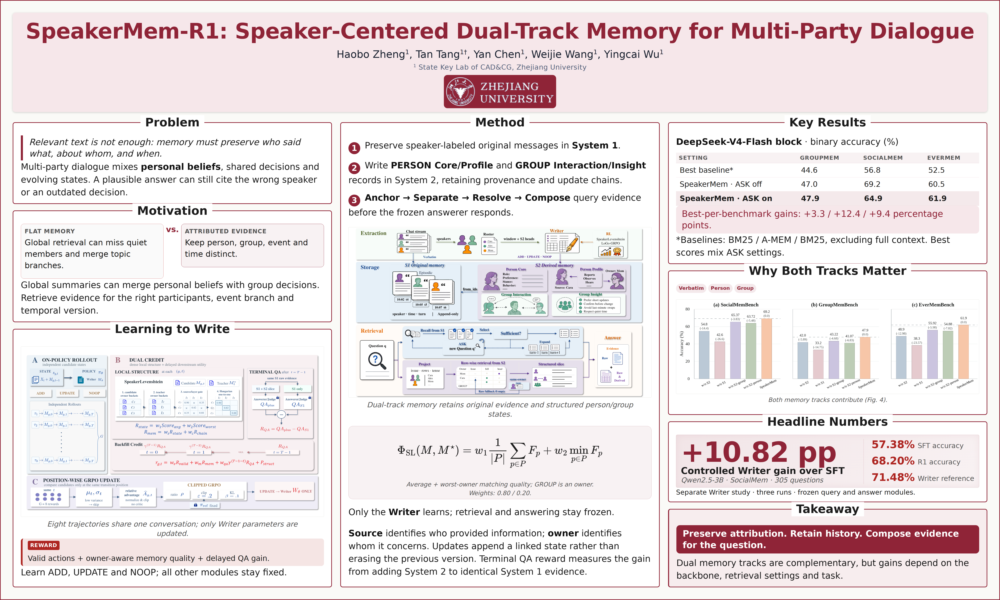
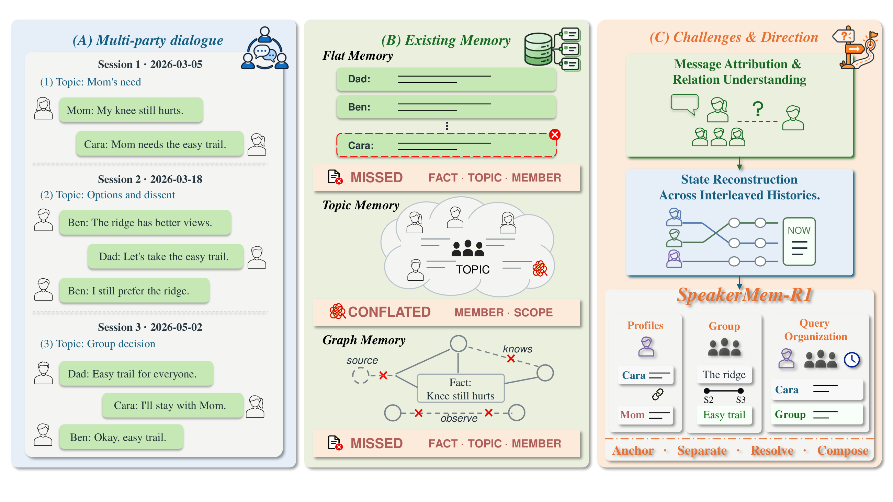
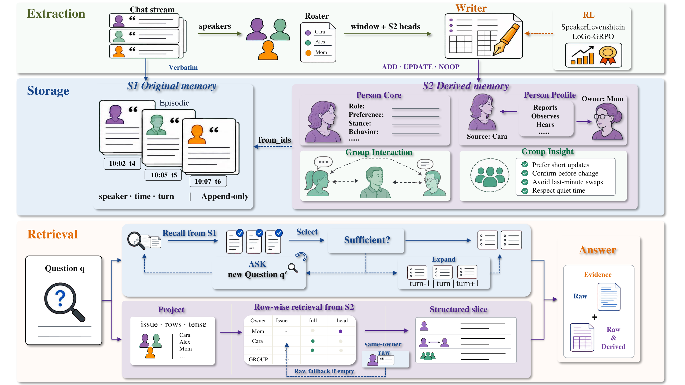
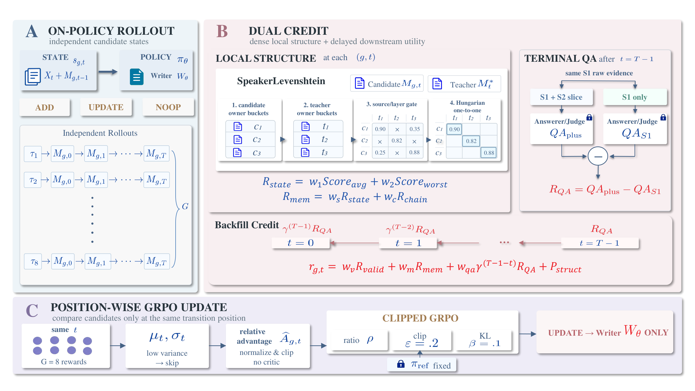

<h1 align="center">SpeakerMem-R1</h1>

<h3 align="center">Speaker-Centered Dual-Track Memory for Multi-Party Dialogue</h3>

<p align="center">
  <a href="https://huggingface.co/papers/2609.26780"></a>
</p>

<p align="center">
  <a href="https://arxiv.org/abs/2609.26780"></a>
  &nbsp;
  <a href="https://2022hpsk.github.io/SpeakerMemR1/"></a>
  &nbsp;
  <a href="https://github.com/2022hpsk/SpeakerMemR1"></a>
  <br>
  <a href="#quick-start"></a>
  &nbsp;
  <a href="#citation"></a>
  &nbsp;
  <a href="LICENSE"></a>
</p>

Excited to share our work on **SpeakerMem-R1**! Recent benchmarks reveal a surprising gap: **general-purpose memory systems struggle with multi-party conversations and can even underperform simple BM25 retrieval in some settings.** These limitations highlight two core challenges: **message attribution and state reconstruction** in long-term multi-party dialogue.

We introduce **SpeakerMem-R1**, a speaker-centered dual-track memory framework designed to address these challenges.

🧠 **Two complementary memory tracks**: SpeakerMem-R1 keeps speaker-labeled messages verbatim while organizing derived states into person- and group-level memories. At query time, it combines both to recover evidence across people, events, and time.

📝 **Learning to write better memories**: SpeakerLevenshtein rewards and speaker-conditioned RL improve a Qwen2.5-3B Writer from **57.38% to 68.20%** downstream QA accuracy in a controlled evaluation, with retrieval and answering frozen.

📊 **Stronger results across three multi-party benchmarks**: SpeakerMem-R1 improves accuracy over the strongest evaluated memory/retrieval baselines by **3.3, 12.4, and 9.4 percentage points** on GroupMemBench, SocialMemBench, and EverMemBench, respectively. In our comparison with **EverMind-AI’s publicly reported EverMemBench leaderboard**, it achieves **62.33% accuracy**, leading the compared systems, including EverOS (**60.08%**) and RippleMem (**54.75%**).

This repository contains the inference package, benchmark runners, writer-training recipes, evaluation outputs, and the static project webpage.

<p align="center">
  <a href="https://microsoft.github.io/ResearchStudio/trending-paper/?mode=weekly&amp;week=2026-W39&amp;paper=2609.26780&amp;view=reel">
    
  </a>
  <br>
  <sub>Visual poster generated by <a href="https://microsoft.github.io/ResearchStudio/">ResearchStudio</a>.</sub>
</p>

## Why multi-party memory needs structure

A statement’s speaker is not always the person it describes. Group decisions, personal preferences, and changing plans must remain distinguishable even when their evidence is scattered across a conversation.



*Figure 1. Multi-party dialogue introduces attribution and scope distinctions, while interleaved histories require reconstructing states across participants and time. [View PDF](webpage/dist/assets/figure1.pdf).*

## What the system does

Multi-party memory requires more than retrieving text that matches a query. The system must preserve attribution and distinguish a person’s statement from an observation about another person, a cross-speaker event, or a group decision. SpeakerMem uses two complementary tracks:

* **System 1 — raw evidence.** Every input message is stored verbatim in `per_speaker_episodic` with speaker and time metadata. This track keeps exact wording and local context available for questions that depend on the original utterance.
* **System 2 — structured memory.** A writer emits `ADD`, `UPDATE`, or `NOOP` actions for four derived layers: `per_speaker_core`, `per_speaker_profile`, `group_interaction`, and `group_insight`. Each entry keeps owner, source, layer, type, timestamp, provenance links, and non-destructive update links.
* **Query-time composition.** A query is projected into speaker, scope, temporal, and issue constraints. System 1 and System 2 retrieve evidence independently, optional local expansion and ASK are applied when enabled, and the final evidence set is composed for the answerer. The default main evaluation uses System 1 top-k = 10, System 2 k = 2, and source-k = 1; the no-ASK configuration is used for the principal comparison reported in the paper.

The writer can be an external LLM or a locally served model. The RL experiments train a Qwen2.5-3B Writer so that the memory-writing component can be deployed locally while the rest of the evaluation pipeline remains configurable.



*Figure 2. SpeakerMem-R1 architecture. System 1 retains verbatim messages; System 2 organizes linked person- and group-level states. Query-time retrieval combines the two tracks while retaining attribution and provenance. [View PDF](webpage/dist/assets/figure2.pdf).*

## Repository layout

```text
SpeakerMemR1/
├── code/
│   ├── speakermem_pkg/            # installable SpeakerMem package and tests
│   ├── speakermem_pkg/examples/   # SocialMemBench example runner
│   ├── writer_training/           # SFT/RL data, rewards, rollouts, scripts
│   ├── topk_sensitivity_full_llm/  # full-LLM retrieval-budget study
│   ├── GroupMemBench/             # benchmark helpers and prompts
│   ├── LoCoMo/                    # upstream placement notes
│   ├── SocialMemBench/            # release metadata
│   ├── EverMemBench-Dynamic/      # release metadata
│   ├── run_baseline.py            # BM25/dense/full-context baselines
│   ├── run_locomo.py              # LoCoMo evaluation runner
│   └── compute_metrics.py         # accuracy, exact match, F1, and timing
├── results/                       # question-level outputs and summaries
├── webpage/dist/                  # static project webpage (GitHub Pages root)
├── DATA_SOURCES.md                # benchmark download and placement guide
├── LICENSE                        # MIT license for original project code
└── THIRD_PARTY_NOTICES.md          # third-party attribution and terms
```

The result files are organized by `main`, `baselines`, `ablations`, `training`, `locomo`, and `topk_sensitivity_full_llm`. Question-level JSONL files can contain benchmark-derived questions, answers, and retrieved context; they are distributed as experiment outputs and do not replace the source benchmark releases.

<a id="quick-start"></a>

## Quick Start

### Installation

The commands below assume the shell is at the repository root.

```bash
python3 -m venv .venv
source .venv/bin/activate
python -m pip install --upgrade pip
python -m pip install -r code/requirements.txt
python -m pip install -e code/speakermem_pkg
python -m pip install -e "code/speakermem_pkg[dev]"
```

Optional vector backends are available with `-e "code/speakermem_pkg[faiss]"` or `-e "code/speakermem_pkg[chroma]"`. A CPU environment is sufficient for the package smoke tests. Full benchmark runs additionally require the model services used by the selected configuration and their credentials.

Create credentials outside version control. `code/.env.example` lists the variable names consumed by the LLM clients. Do not commit `.env`, API keys, model caches, checkpoints, or local memory stores.

### Store a conversation and retrieve evidence

This minimal example follows [`quickstart.py`](code/speakermem_pkg/examples/quickstart.py). It stores a four-person conversation and retrieves speaker-labeled evidence for two questions. It runs locally without an API key; the `all-MiniLM-L6-v2` embedding model may be downloaded on first use.

```python
from speakermem import SpeakerMemory, SpeakerMemConfig, WriterConfig, RetrieverConfig

# Use local verbatim retrieval for this first example.
cfg = SpeakerMemConfig(
    writer=WriterConfig(enabled=False),
    retriever=RetrieverConfig(llm_select=False, ask_enabled=False, s2_enabled=False),
)
mem = SpeakerMemory(config=cfg)

msgs = [
    {"speaker": "Alice", "content": "I will lead model training.", "session": "s1"},
    {"speaker": "Bob", "content": "I will handle data cleaning.", "session": "s1"},
    {"speaker": "Carol", "content": "I will monitor evaluation and metrics.", "session": "s1"},
    {"speaker": "Dave", "content": "I will handle the frontend and demo.", "session": "s1"},
]
mem.ingest(msgs)
mem.flush()
print("stats:", mem.stats())

for question in ["Who handles evaluation?", "What does Bob handle?"]:
    print(f"\nQ: {question}")
    for entry in mem.retrieve(question, k=3):
        print("   ", entry.render())
```

After installation, run the included example from the repository root:

```bash
python code/speakermem_pkg/examples/quickstart.py
```

The output includes memory statistics and retrieved entries with their speaker attribution. This example returns evidence rather than generating an answer, and keeps the derived-memory Writer and System 2 disabled. For the full dual-track pipeline with model-backed writing and answering, configure the model endpoint and credentials in [`code/.env.example`](code/.env.example), then follow [Run SpeakerMem evaluation](#run-speakermem-evaluation).

## Offline checks

These checks do not contact an LLM or require benchmark payloads:

```bash
PYTHONPATH=code/speakermem_pkg/src \
  python -m pytest -q code/speakermem_pkg/tests/test_smoke.py

PYTHONPATH=code/writer_training:code/speakermem_pkg/src \
  python -m pytest -q code/speakermem_pkg/tests/test_training.py

python -m py_compile \
  code/run_baseline.py code/run_locomo.py code/compute_metrics.py \
  code/writer_training/*.py code/topk_sensitivity_full_llm/run_sensitivity.py
```

The tests cover verbatim ingestion, persistence, speaker-aware retrieval, update chains, action validation, trajectory generation, and reward behavior. They do not validate remote model availability or benchmark licensing.

## Obtain benchmark data

The complete benchmark payloads are intentionally not copied into this repository. Follow [DATA_SOURCES.md](DATA_SOURCES.md) to download the canonical releases and place them under `code/`. The document records expected paths, release identifiers, source URLs, and the ten-network held-out inputs used by the writer evaluation. The included metadata and training artifacts are enough to inspect the data flow, but a full reproduction requires the public benchmark payloads and the external held-out memory store used by the full-LLM sensitivity script.

Benchmark attribution and retained license notices are collected in [THIRD_PARTY_NOTICES.md](THIRD_PARTY_NOTICES.md). Please check each upstream license before redistributing downloaded payloads or derived question-level outputs.

## Run SpeakerMem evaluation

The main runner is `code/speakermem_pkg/examples/socialmembench.py`. It supports SocialMemBench, GroupMemBench, and EverMemBench through a common interface. A minimal SocialMemBench invocation after data placement is:

```bash
cd code
PYTHONPATH=.:speakermem_pkg/src \
  python speakermem_pkg/examples/socialmembench.py \
    --benchmark socialmem \
    --domain all \
    --top-k 10 \
    --s2-k 2 \
    --s2-source-k 1 \
    --results-dir ../results/local_run
```

Add `--ask-enabled` to enable the optional ASK route. `--our-answerer` selects the answerer route used in the main SpeakerMem evaluation. `--writer-vllm-url` and `--writer-vllm-model` point to a locally served Writer; otherwise the configured external LLM is used for writing. Use `--ingest-only` to build a memory store without running QA, and `--resume` to reuse a complete compatible store. Run `python speakermem_pkg/examples/socialmembench.py --help` for the full list of options.

The baseline runner uses the official implementation/configuration where available and the documented baseline settings; the evaluation interface, data split, metrics, and judge configuration are the controlled comparison points.

```bash
cd code
python run_baseline.py --baseline bm25 --benchmark groupmem \
  --domain all --top-k 10 --agent-model deepseek-v4-flash \
  --judge-model deepseek-v4-flash --results-dir ../results/local_baseline
```

`run_baseline.py` also supports `embed`, `mem0`, `amem`, and `hipporag` where their dependencies and data are available. The full-context option is only appropriate for the SocialMemBench input; the other benchmark contexts are too long for a meaningful full-context comparison.

For LoCoMo, place `locomo10.json` at the path documented in [DATA_SOURCES.md](DATA_SOURCES.md), then run:

```bash
cd code
PYTHONPATH=.:speakermem_pkg/src python run_locomo.py \
  --data LoCoMo/locomo10.json --top-k 10 \
  --results-dir ../results/local_locomo
```

## Writer training



*Figure 3. Writer-R1 training. A locally deployable Writer learns structured memory construction with SpeakerLevenshtein-based rewards, while the query and answer pipeline remains frozen in the controlled comparison. [View PDF](webpage/dist/assets/figure3.pdf).*

`code/writer_training/` contains the disjoint training and held-out network manifests, trajectory schema, supervised recipe, reinforced recipe, reward implementation, and offline tests. It does not include model weights, optimizer state, GPU logs, or credentials.

The supplied training list has 15 complete networks, 73 Writer segments, 89 terminal QA items, and 452 supervised actions (430 `ADD`, 20 `UPDATE`, and 2 `NOOP`). The effective training signal comes from repeated Writer decisions within each network rather than from 15 isolated examples. The held-out evaluation uses ten networks and 305 SocialMemBench questions.

Inspect the scripts before launching a training job because paths, serving endpoints, and GPU placement are environment-specific:

```bash
cd code/writer_training

# supervised Writer recipe
bash run_sft.sh

# reinforced Writer recipe (requires a CUDA device and local model service)
bash run_r1_training.sh

# evaluate a locally served Writer on the held-out networks
bash run_r1.sh
```

The saved aggregate outputs are under `results/training/supervised/` and `results/training/reinforced/`. The RL/LLM comparison is under `results/training/rl_llm_compare/` and includes the selected units, question IDs, aggregate summary, and question-level outputs. The reference state used while constructing RL trajectories is proxy supervision generated by a teacher; it is documented by the trajectory and reward code and should not be interpreted as an independently human-labeled gold state.

## Retrieval-budget sensitivity

The full-LLM sensitivity study is isolated in `code/topk_sensitivity_full_llm/`. It reuses the ten held-out SocialMemBench networks and 305 questions, keeps the memory store fixed, does not load an RL/SFT/Qwen Writer, and disables ASK. The grid varies System 1 top-k in `{5, 10, 20}` and System 2 k in `{2, 4, 6}` with source-k fixed at 1.

```bash
python code/topk_sensitivity_full_llm/run_sensitivity.py \
  --project-root /path/to/research/repository \
  --output-dir results/topk_sensitivity_full_llm --smoke

python code/topk_sensitivity_full_llm/run_sensitivity.py \
  --project-root /path/to/research/repository \
  --output-dir results/topk_sensitivity_full_llm
```

The included summary reports all nine configurations. The highest observed binary accuracy is 73.11% at System 1 top-k = 20 and System 2 k = 4; the corresponding token-F1 is 26.53%. These are held-out sensitivity results, not a replacement for the principal benchmark table.

## Included results

The table below summarizes the aggregate files included in this repository. Accuracies are binary LLM-judge accuracy computed from the stored `correct` and `total` counts. Judge and answerer settings are part of each experiment directory; inspect the corresponding JSON and README before comparing rows across configurations.

| Evaluation | Configuration | Correct / total | Accuracy |
| --- | --- | ---: | ---: |
| GroupMemBench | DeepSeek-V4-Flash, no ASK | 350 / 745 | 46.98% |
| SocialMemBench | DeepSeek-V4-Flash, no ASK | 713 / 1,031 | 69.16% |
| EverMemBench-Dynamic | DeepSeek-V4-Flash, no ASK | 1,452 / 2,400 | 60.50% |
| GroupMemBench | DeepSeek-V4-Flash, ASK | 357 / 745 | 47.92% |
| SocialMemBench | DeepSeek-V4-Flash, ASK | 669 / 1,031 | 64.89% |
| EverMemBench-Dynamic | DeepSeek-V4-Flash, ASK | 1,485 / 2,400 | 61.88% |
| LoCoMo | DeepSeek-V4-Flash, stored summary | 1,407 / 1,986 | 70.85% |
| Held-out SocialMem (Writer SFT) | ten networks, 305 questions | 175 / 305 | 57.38% |
| Held-out SocialMem (Writer RL, 30 steps) | ten networks, 305 questions | 208 / 305 | 68.20% |
| Held-out SocialMem (LLM Writer) | ten networks, 305 questions | 218 / 305 | 71.48% |

For method comparisons, consult the per-run metadata: baselines use their official code, recommended configurations, and prompts where available, with data, metrics, judge, and evaluation interface controlled.

Additional stored outputs include:

* component and track ablations in `results/ablations/`;
* DeepSeek-V4-Flash and GPT-5.6-Luna baseline metrics in `results/baselines/`;
* category-level and question-level JSONL outputs for all three multi-party benchmarks;
* the LoCoMo summary and question-level records in `results/locomo/`;
* the nine full-LLM top-k configurations in `results/topk_sensitivity_full_llm/`;
* supervised, reinforced, and LLM-Writer comparison artifacts in `results/training/`.

Use `code/compute_metrics.py` to recompute binary accuracy, exact match, token-F1, attribution metrics, and timing summaries from question-level records. The paper’s challenge dimensions are an analysis framework derived from question requirements and error patterns; they are not presented here as independently human-validated diagnostic labels.

## License and citation

Original SpeakerMem-R1 code is released under the [MIT License](LICENSE). Third-party code and benchmark-derived materials retain their upstream terms; see [THIRD_PARTY_NOTICES.md](THIRD_PARTY_NOTICES.md) and [DATA_SOURCES.md](DATA_SOURCES.md) before downloading or redistributing them.

<a id="citation"></a>

Please cite our paper as:

```bibtex
@article{zheng2026speakermemr1,
  title={SpeakerMem-R1: Speaker-Centered Dual-Track Memory for Multi-Party Dialogue},
  author={Zheng, Haobo and Tang, Tan and Chen, Yan and Wang, Weijie and Wu, Yingcai},
  journal={arXiv preprint arXiv:2609.26780},
  year={2026}
}
```

When reporting benchmark results, cite the original benchmark papers and repositories listed in [DATA_SOURCES.md](DATA_SOURCES.md), and preserve their licenses and attribution requirements.
